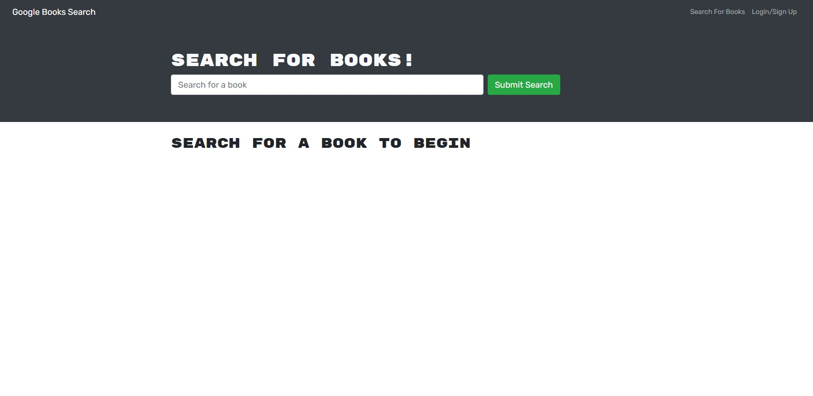

# Google Books Search Engine

## Description

Provide a short description explaining the what, why, and how of your project. Use the following questions as a guide:

- What was your motivation?
- Why did you build this project? (Note: the answer is not "Because it was a homework assignment.")
- What problem does it solve?
- What did you learn?

## Installation

- Have Nodejs installed (I used v16.18)
- Install npm dependencies
    - use 'npm install' on terminal once navigated to folder
- create a .env file, rename/use the [.env.EXAMPLE file](./server/.env.EXAMPLE)
    - create your own secret for better security

## Usage

Navigate to the root directory of the project in your terminal and install the dependencies with 'npm i' then start the server with 'npm run develop'. The application will be deployed on your localhost with port 3000. When you first start the application you should see something similar to the image below. You can make an account or login if you've already made one. Then type in a book title into the search which will display matching books. If you're logged in you will see a button to save the book. If you click the "See Your Books" navigation link it will take you a page with a list of books you have saved each with a button to delete it from your list. You can also view a [working application through this heroku link.](https://search-google-books.herokuapp.com/)

## Credits

N/A

## License

N/A